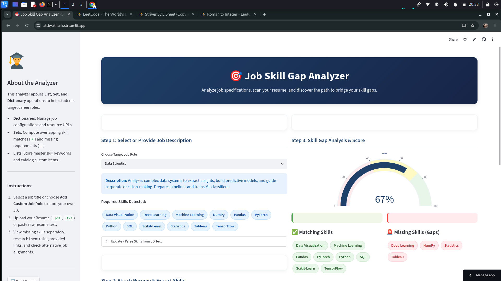

# 🎯 Job Skill Gap Analyzer

A **Streamlit-based intelligent web application** that analyzes **job descriptions** against **resumes** to identify skill gaps, calculate match scores, and provide personalized learning resources to help users improve their job readiness.

---
## 📸 Application Screenshot


---

## 🚀 Features

* 📄 Upload resumes in **PDF** or **TXT** format, or paste resume text manually.
* 🧠 Automatic skill extraction using rule-based NLP matching.
* 🎯 Compare job description skills with resume skills.
* 📊 Interactive match score visualization using a Plotly gauge chart.
* 🚨 Identify missing skills through skill gap analysis.
* 📘 Get personalized learning resources from YouTube, Coursera, and Google.
* 🧪 Receive mini-project suggestions for each missing skill.
* 🔍 Discover alternative job role recommendations based on your profile.
* ➕ Add custom job roles dynamically.

---

## 🛠️ Tech Stack

* Python 🐍
* Streamlit 🎈
* Pandas 📊
* Plotly 📈
* PyPDF 📄
* Regular Expressions (Regex) for rule-based skill extraction

---

## 📂 Project Structure

```text
ATS/
│── app.py
│── requirements.txt
└── README.md
```

---

## 🌐 Live Demo

**https://atsbyakilank.streamlit.app/**

---or---

## ⚙️ Installation & Setup

### 1. Clone the Repository

```bash
git clone https://github.com/Akil81485/ATS.git
cd ATS
```

### 2. Create a Virtual Environment (Optional but Recommended)

**Windows**

```bash
python -m venv venv
venv\Scripts\activate
```

**Linux / macOS**

```bash
python3 -m venv venv
source venv/bin/activate
```

### 3. Install Dependencies

```bash
pip install -r requirements.txt
```

### 4. Run the Application

```bash
streamlit run app.py
```

After the application starts, open your browser and visit:

```text
http://localhost:8501
```
